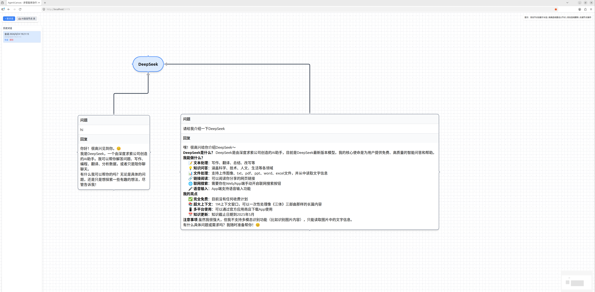

# AgentCanvas

> 无限画布 · 多智能体协作推理链

AgentCanvas 是一个可视化的多智能体协作平台。你可以在无限画布上创建对话节点，通过树形结构构建推理链，每个节点代表一轮完整的问答。支持文件上传、节点隐藏、自动分支、多会话管理，所有数据自动保存在浏览器本地。

## ✨ 核心特性

- 🎨 **无限画布** — 基于 React Flow，流畅拖拽、缩放（支持 0.05 极缩）、平移
- 🌲 **树形对话节点** — 每个节点包含问题与回复，沿父链向上追溯上下文
- 🔗 **四方向连线** — 上下左右任意连接，精准控制连接点，末端带箭头，默认深色加粗
- 💫 **流光线动画** — 发送消息时，从当前节点到根节点呈现金色脉冲，路径一目了然
- 🤖 **多 Agent 支持** — 可配置 DeepSeek、Qwen、OpenAI 等模型 API
- 🧠 **AI 自动节点** — 当回复需要其他 Agent 协助时，自动创建高亮节点（可开关）
- 📎 **文件上传** — 支持多种文本格式，附件标签持久显示，内容前置以利用缓存
- 👻 **节点隐藏** — 隐藏节点自身不参与上下文，但不影响子节点追溯
- 📁 **多会话管理** — 新建、恢复、删除、**双击重命名**会话，自动持久化至 localStorage
- 📏 **可调宽度** — 拖拽节点边缘自由调整宽度（200–1000px）
- ♻️ **循环检测** — 自动防止父子连线形成循环引用
- 📋 **内容复制** — 右键一键复制节点的问题与回复到剪贴板
- 🎯 **Markdown 完善渲染** — 支持表格、代码块、列表等完整 GFM 语法

## 🛠️ 技术栈

| 层级 | 技术 |
|------|------|
| 前端 | React 18 + React Flow 11 + Zustand + Tailwind CSS + Vite |
| 后端 | Node.js + Express + OpenAI SDK (兼容多模型) |
| 数据持久化 | Zustand persist + localStorage |

## 📦 快速开始

### 环境要求

- Node.js >= 18
- npm 或 yarn

### 安装（linux）

    cd ./backend
    npm install
    
    cd ./frontend
    npm install

### 运行（linux）

    ./script_run.sh

### 安装（windows）

    cd ./backend
    npm.cmd install
    
    cd ./frontend
    npm.cmd install

### 运行（windows）

    Start-Process powershell -ArgumentList "-NoExit", "-Command", "cd './frontend'; npm.cmd run dev"; Start-Process powershell -ArgumentList "-NoExit", "-Command", "cd './backend'; npm.cmd start"

### 打开界面

    浏览器中输入：http://localhost:5173/

## 详见信息

AgentCanvas_productSpecifications.md

## 注意

该项目默认使用DeepSeek，需要在backend中添加.env文件，文件内保存API的密钥，文件的格式如下：
DEEPSEEK_API_KEY=[Your API Key]

## 许可说明

本仓库代码采用 个人非商业使用许可证。允许个人学习、研究、非商业项目免费使用。商业使用必须购买授权，请联系 [iamwanglihaha@gmail.com]。

💖 [Sponsor](https://iamwangli.github.io/agent-canvas/donate/)
